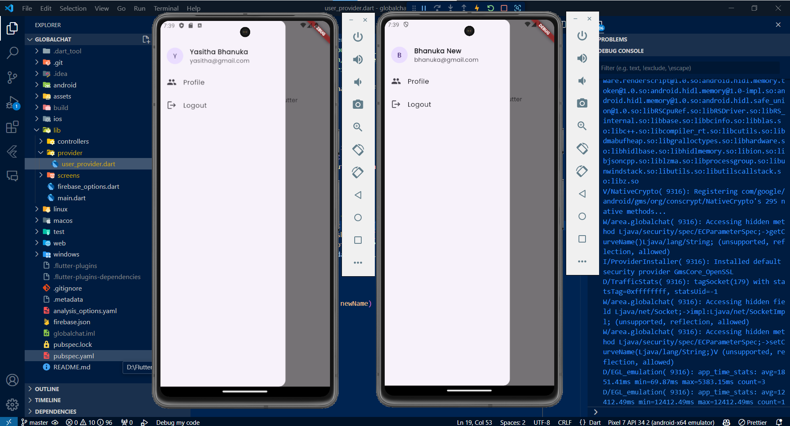
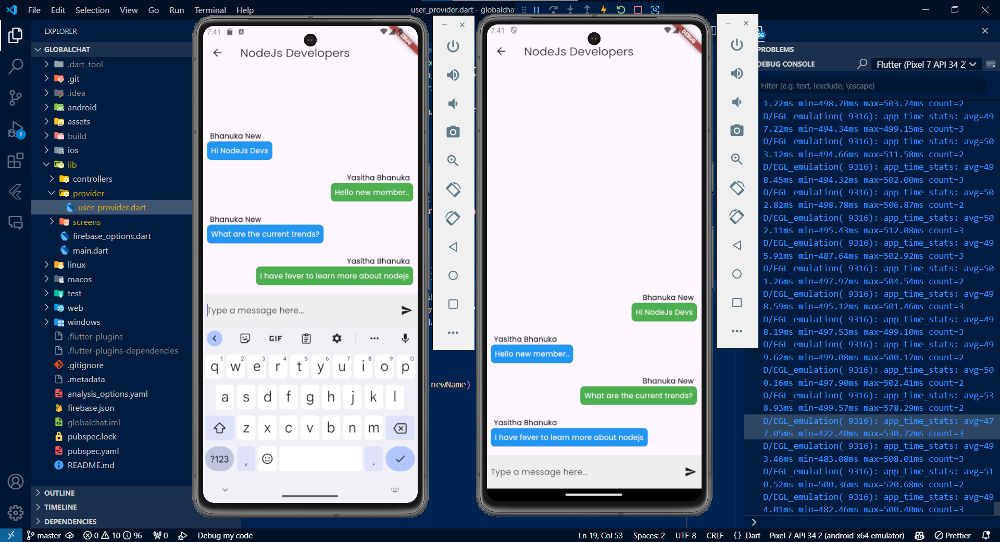

# 🌐 GlobalChat

Welcome to **GlobalChat**, a Flutter project designed for seamless global communication. This app leverages the power of Firebase to provide real-time chat functionality with a modern and intuitive user interface.

## 🚀 Getting Started

To get started with this project, ensure you have Flutter installed on your machine. For more information on setting up Flutter, visit the [official documentation](https://docs.flutter.dev/get-started/install).

### 📦 Dependencies

This project uses several key packages to deliver its functionality:

- **firebase_core**: For initializing Firebase in the Flutter app.
- **firebase_auth**: For authentication using Firebase.
- **cloud_firestore**: For database operations with Firestore.
- **provider**: For state management.
- **flutter/material.dart**: For building the UI components.

### 📚 Resources

Here are some resources to help you get started with Flutter:

- [Lab: Write your first Flutter app](https://docs.flutter.dev/get-started/codelab)
- [Cookbook: Useful Flutter samples](https://docs.flutter.dev/cookbook)
- [Online documentation](https://docs.flutter.dev/): Tutorials, samples, guidance on mobile development, and a full API reference.

## ✨ Features

- **Authentication**: User authentication using Firebase Auth.
- **Real-time Chat**: Real-time messaging with Firestore.
- **Profile Management**: Users can update their profile information.
- **Chatroom Management**: Create and manage chatrooms.
- **Responsive UI**: Modern and responsive user interface.

## 🛠️ Installation

1. **Clone the repository**:
  ```sh
  git clone https://github.com/Yasitha-Bhanuka/GlobalChat-Flutter-App.git
  cd globalchat
  ```

2. **Install dependencies**:
  ```sh
  flutter pub get
  ```

3. **Run the app**:
  ```sh
  flutter run
  ```

## 📜 Highlights

### 🛠️ Development and Enhancements

- **User Authentication**: Implemented user login and signup with Firebase Auth.
- **Chat Functionality**: Developed real-time chat features using Firestore.
- **Profile Updates**: Enabled profile updates and real-time data fetching.
- **UI/UX Improvements**: Added various UI enhancements for a better user experience.
- **Error Handling**: Improved error handling and validation throughout the app.

### 🔧 Configuration

- **Firebase Setup**: Configured Firebase for authentication and Firestore for database operations.
- **State Management**: Utilized the Provider package for efficient state management.
- **Form Validation**: Implemented form validation for signup and login screens.

## 📽 ScreenRecorders
- **Make the user account**
- **Update the user details**
- **Logged device next opening navigate to the dashboard**
- **After logout, App navigate to the login screen**
https://github.com/user-attachments/assets/c5a5275f-300b-4b3e-800f-449891634fbf

- **Goto the chatrooms and send the message**
- **Logout and login another account see the chatroom messages**
- **Send the another message using current account**
- **Check weather your message and others sended massages wrapping left and right with the senders name**
https://github.com/user-attachments/assets/d9e87039-ddf2-400b-85ff-1ad3638e7121

## 📸 Screenshots




## 🤝 Contributing

Contributions are welcome! Please fork this repository and submit a pull request for any improvements or bug fixes.


